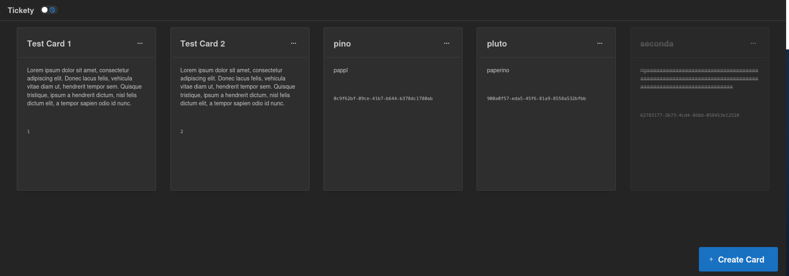

# Tickety

A minimal TODO list in Next JS, React and Typescript, that runs in your browser.


This is a [Next.js](https://nextjs.org) project bootstrapped with [`create-next-app`](https://nextjs.org/docs/app/api-reference/cli/create-next-app).
It uses [Mantine library](https://mantine.dev/) for UI and [Redux Toolkit](https://redux-toolkit.js.org/) to manage the state.

## Feature

1. 😎 *Privacy First*: It just uses your [Local Storage](https://developer.mozilla.org/en-US/docs/Web/API/Web_Storage_API). No data collected! Trust me... or your network panel, for what I care
1. 🟧 *Minimal*: no graphical, data, other stuffs. Just strict to the point
1. 🧘 *Stress Free*: no due date. No planning. Just pin what you want to remember, and they stay here for all the time you need!
1. 🤝 *Open Source*: I mean, you see it here, on [Github](https://github.com/CoachGodzup/tickety), so... it's free as in free speech!

## Getting Started

First, run the development server:

```bash
pnpm dev
#if your node version with nvm is old
nvm use node
npm run dev
```

Open [http://localhost:3000](http://localhost:3000) with your browser to see the result and... 📌 happy pinning!

This project uses [`next/font`](https://nextjs.org/docs/app/building-your-application/optimizing/fonts) to automatically optimize and load [Geist](https://vercel.com/font), a new font family for Vercel.
